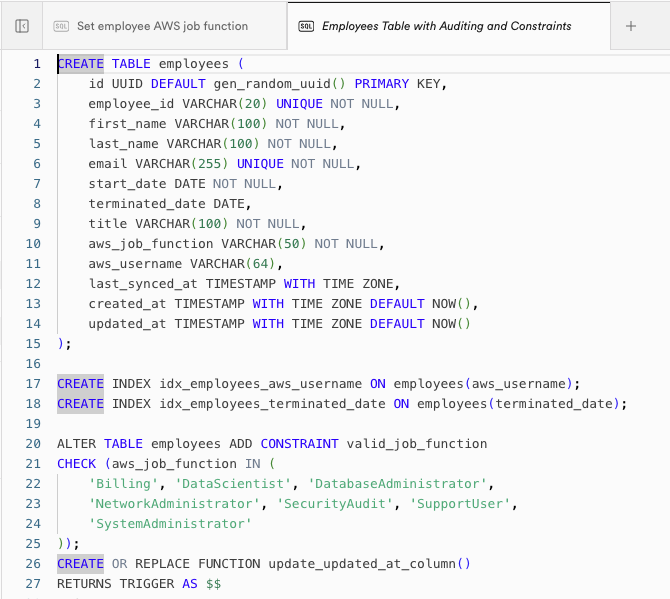
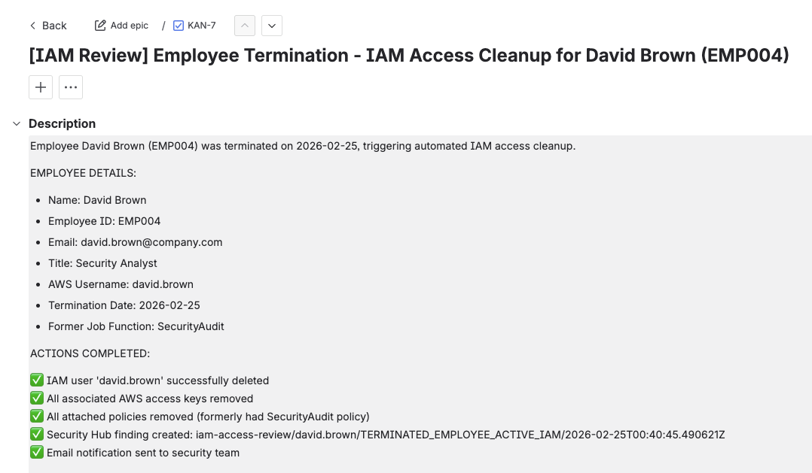
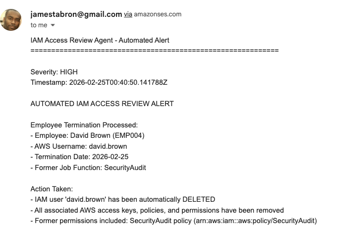

# AI Powered IAM Access Review Agent

> An autonomous IAM governance system that continuously monitors your employee database and automatically synchronizes AWS IAM permissions in real-time—eliminating manual access reviews and enforcing least-privilege at scale.

[](https://aws.amazon.com/bedrock/)
[-6B4FBB)](https://anthropic.com)
[](https://supabase.com)

---

## 🎯 Overview

The AI Powered IAM Access Review Agent continuously enforces alignment between your employee database and AWS IAM — automatically provisioning access for new hires, updating permissions on role changes, and revoking access for terminated employees. It also detects and blocks unauthorized direct IAM modifications, creating Security Hub findings and audit trails for every action taken.

No more quarterly access reviews. No more offboarding checklists. No more orphaned accounts.

### Key Benefits

- 🔄 **Real-Time Synchronization**: Employee database changes trigger immediate IAM updates — no lag, no manual intervention
- 🚫 **Unauthorized Change Prevention**: Direct IAM modifications are detected, blocked, and alerted via EventBridge + CloudTrail
- 📋 **Automated Audit Trail**: Every IAM action is logged as a Security Hub finding with NIST 800-53 control references
- 🎫 **Automated Ticketing**: Jira tickets created automatically for every discrepancy detected
- 📧 **Real-Time Alerts**: SES email notifications for high-severity IAM events
- 🧠 **AI-Powered Reasoning**: Claude reasons through complex employee lifecycle events and makes context-aware IAM decisions

---

## 🎬 Demo

### Supabase Employee Database (Source of Truth)


*Employee records drive all IAM decisions — job function changes and termination dates trigger automatic synchronization*

### Automated Jira Ticket Creation


*Every IAM discrepancy automatically generates a tracked Jira ticket in your project*

### Email Alert


*Real-time email notifications for terminations, policy mismatches, and unauthorized changes*

### Security Hub Findings


*Audit-ready findings with NIST 800-53 control mappings (AC-2, AC-6) for every IAM action*

---

## 💡 The Problem

### Traditional IAM Access Review Process

```
Quarterly reminder sent to managers
    ↓
Managers manually review employee access lists
    ↓
Security team cross-references HR data
    ↓
Tickets created for each discrepancy
    ↓
IT manually updates IAM permissions
    ↓
Auditor requests evidence of review
    ↓
Security team scrambles to produce documentation
    ↓
Repeat in 90 days
```

**Result**: Access reviews take weeks, terminated employees retain access for days or weeks, and audit evidence is inconsistent.

### The AI Access Review Solution

```
Employee DB Change → Supabase Webhook → Lambda → AgentCore Agent → IAM Update + Jira + Email + Security Hub
```

**Result**: IAM permissions stay continuously aligned with your employee database. Terminated employees lose access within seconds. Every action is automatically documented.

---

## 🏗️ Architecture

```
┌─────────────────────────────────────────────────────────────┐
│                    PROACTIVE REMEDIATION                     │
│                                                             │
│  Supabase DB ──► Webhook ──► API Gateway ──► Lambda         │
│  (Employee       (Change      (HTTPS        (Receiver)      │
│   Records)        Event)       Endpoint)         │          │
│                                                  ▼          │
│                                          AgentCore Agent    │
│                                          (Claude Reasoning) │
│                                                  │          │
│                              ┌───────────────────┤          │
│                              ▼           ▼       ▼          │
│                             IAM        Jira     SES         │
│                           (Update)   (Ticket) (Email)       │
│                              │                              │
│                              ▼                              │
│                        Security Hub                         │
│                         (Finding)                           │
└─────────────────────────────────────────────────────────────┘

┌─────────────────────────────────────────────────────────────┐
│                   PREVENTATIVE CONTROLS                      │
│                                                             │
│  CloudTrail ──► EventBridge ──► Lambda Validator            │
│  (IAM Event)    (Rule Match)    (Block + Alert + Revert)    │
└─────────────────────────────────────────────────────────────┘
```

---

## 🔄 How It Works

### Employee Lifecycle Events

**New Hire (INSERT)**
1. New employee record created in Supabase
2. Webhook triggers Lambda → AgentCore agent
3. Agent creates IAM user with policies matching the employee's job function
4. Security Hub finding created, Jira ticket opened, email sent

**Role Change (UPDATE)**
1. Manager updates employee's `aws_job_function` in Supabase
2. Agent detects policy mismatch between current IAM policies and new job function
3. Agent detaches old policies, attaches new ones aligned to updated role
4. Full audit trail generated

**Termination (UPDATE)**
1. Manager sets `terminated_date` to today's date or past date in Supabase
2. Agent immediately detects terminated employee with active IAM user
3. Agent disables login, removes all policies, and flags for deletion
4. HIGH severity Security Hub finding created with NIST AC-2 reference

### Unauthorized IAM Change Prevention

1. CloudTrail captures direct IAM API call (e.g., `AttachUserPolicy`)
2. EventBridge rule matches unauthorized change pattern
3. Lambda validator checks if change is reflected in employee DB
4. If not authorized: change is reverted, CRITICAL Security Hub finding created, alert sent

---

## 🎯 Job Function → IAM Policy Mapping

| Job Function | AWS Managed Policy |
|---|---|
| Billing | Billing |
| DataScientist | DataScientist |
| DatabaseAdministrator | DatabaseAdministrator |
| NetworkAdministrator | NetworkAdministrator |
| SecurityAudit | SecurityAudit |
| SupportUser | SupportUser |
| SystemAdministrator | SystemAdministrator |

All permissions are derived from AWS managed policies — no custom policy sprawl.

---

## 📊 Security Hub Finding Types

| Finding Type | Severity | Trigger |
|---|---|---|
| `UNAUTHORIZED_IAM_CHANGE` | CRITICAL | Direct IAM change not reflected in employee DB |
| `TERMINATED_EMPLOYEE_ACTIVE_IAM` | HIGH | Terminated employee still has active IAM user |
| `JOB_FUNCTION_MISMATCH` | HIGH | IAM policies don't match employee's job function |
| `IAM_USER_NO_EMPLOYEE_RECORD` | HIGH | IAM user exists with no matching employee record |
| `AUTO_REMEDIATED` | MEDIUM | Agent automatically corrected a discrepancy |

All findings include NIST 800-53 compliance references (AC-2, AC-6) for audit readiness.

---

## 🏢 Use Cases

### 1. Employee Termination

**Scenario**: Employee is terminated and HR updates their record in the employee database  
**Traditional**: IT ticket created, manually processed within 24-72 hours (if remembered)  
**With AI Agent**: IAM access revoked within seconds of termination date being set  
**Impact**: Eliminates insider threat window from delayed offboarding

### 2. Role-Based Access Control Enforcement

**Scenario**: Employee is promoted from SupportUser to SystemAdministrator  
**Traditional**: Employee submits access request ticket, manager approves, IT implements (days later)  
**With AI Agent**: Job function updated in Supabase → policies automatically realigned  
**Impact**: Zero-lag access updates with zero manual steps

### 3. Continuous Compliance Evidence

**Scenario**: SOC 2 auditor requests evidence of quarterly access reviews  
**Traditional**: Security team scrambles to reconstruct access review history  
**With AI Agent**: Security Hub findings provide continuous, timestamped audit trail  
**Impact**: Instant, comprehensive evidence of continuous access monitoring

### 4. Unauthorized Access Prevention

**Scenario**: Administrator attempts to grant elevated permissions outside the approved process  
**Traditional**: Change goes undetected until next access review  
**With AI Agent**: Change detected within minutes, reverted automatically, alert sent  
**Impact**: Preventative control eliminates unauthorized privilege escalation

---

## 🛠️ Tech Stack

| Component | Technology |
|---|---|
| AI Reasoning Engine | Amazon Bedrock (Claude via AWS AgentCore) |
| Agent Orchestration | Strands SDK |
| Employee Database | Supabase (PostgreSQL) |
| Webhook Processing | AWS Lambda + API Gateway |
| Event Detection | AWS CloudTrail + EventBridge |
| IAM Management | AWS IAM |
| Audit Trail | AWS Security Hub |
| Ticketing | Jira (REST API v2) |
| Email Notifications | AWS SES |
| State Management | AWS DynamoDB |
| Secrets Management | AWS Secrets Manager |
| Infrastructure | AWS (us-east-1) |

---

## 💼 Business Impact

### For Security Teams
- ✅ Eliminate manual quarterly access reviews entirely
- ✅ Reduce terminated employee access window from days to seconds
- ✅ Continuous compliance evidence without documentation effort
- ✅ Instant detection and reversion of unauthorized IAM changes

### For Compliance Teams
- ✅ Automated audit trail mapped to NIST 800-53 (AC-2, AC-6)
- ✅ SOC 2 CC6.1, CC6.2, CC6.3 control evidence generated automatically
- ✅ No retroactive evidence gathering for audits
- ✅ Consistent, timestamped record of every IAM decision

### For Operations Teams
- ✅ Zero manual IAM provisioning for standard job functions
- ✅ Self-documenting access management process
- ✅ Jira integration fits into existing IT workflows

### Metrics & ROI

**Time Savings**
- Manual access review cycles: eliminated
- Offboarding IAM steps: 0 manual steps required
- Audit evidence preparation: minutes instead of days

**Risk Reduction**
- Orphaned account exposure window: near-zero
- Unauthorized privilege escalation: automatically detected and reverted
- Audit findings related to access control: significantly reduced

---

## 🔐 Security & Compliance Mapping

### SOC 2 Common Criteria
- **CC6.1** — Logical and physical access controls
- **CC6.2** — Credential issuance tied to authorization
- **CC6.3** — Access removal upon termination or role change

### NIST 800-53 Controls
- **AC-2** — Account Management
- **AC-6** — Least Privilege

### Design Principles
- Supabase employee DB is the single source of truth — IAM never diverges
- All changes are logged before and after — full change history
- Agent operates with least-privilege IAM role — no over-permissioned automation accounts
- Secrets stored in AWS Secrets Manager — no hardcoded credentials

---

## ❓ Frequently Asked Questions

**Q: What happens if the agent can't reach AWS IAM during a termination?**  
A: The event is persisted in DynamoDB with a sync deadline. A scheduled Lambda checks for pending events and retries until the IAM update is confirmed.

**Q: Does this work with existing IAM users, or only new ones?**  
A: Both. The agent compares all existing IAM users against the employee database on each sync check and remediates any discrepancies it finds.

**Q: What if a legitimate admin needs to make a direct IAM change?**  
A: The recommended approach is to update the employee database first, letting the agent make the IAM change. If a direct change is truly needed, the EventBridge rule can be temporarily disabled with appropriate change management documentation.

**Q: How does the agent handle edge cases like contractors or shared accounts?**  
A: Accounts not present in the employee database are flagged as `IAM_USER_NO_EMPLOYEE_RECORD` findings, prompting review rather than automatic deletion — preventing accidental removal of legitimate service accounts.

**Q: What does it cost to run?**  
A: Costs are primarily AWS service costs:
- Amazon Bedrock (Claude): ~$0.01-0.05 per agent invocation
- Lambda: negligible at typical employee change volumes
- Security Hub: ~$0.001 per finding
- DynamoDB, SES, Secrets Manager: negligible
- **Total: ~$10-50/month** depending on employee change frequency

**Q: Can this be adapted for Azure AD or Google Workspace?**  
A: The architecture pattern is cloud-agnostic. The IAM-specific tools can be replaced with Azure AD Graph API or Google Admin SDK equivalents while keeping the same AgentCore + Supabase + webhook pattern.

---

## 🎓 Best Practices

### Initial Setup
1. **Start with read-only mode**: Run the agent in observation mode first to validate it correctly identifies discrepancies before enabling auto-remediation
2. **Seed your employee database carefully**: Ensure all existing IAM users have matching employee records before enabling termination detection
3. **Test with non-production accounts**: Validate the full pipeline on test IAM users before pointing at production

### Ongoing Operations
1. **Monitor Security Hub findings daily**: Findings are your primary operational dashboard
2. **Review Jira tickets promptly**: AUTO_REMEDIATED tickets should be reviewed to confirm intended behavior
3. **Audit the agent's IAM role quarterly**: Ensure the automation role itself follows least privilege
4. **Keep Supabase as the authoritative source**: Never make IAM changes directly — always go through the DB

---

## 🎯 Quick Stats

- ⚡ **Access Revocation Time**: Seconds after termination date is set
- 🔄 **Sync Frequency**: Real-time (event-driven) + 1-minute enforcement window
- 📊 **Compliance Frameworks**: SOC 2, NIST 800-53
- 🚫 **Manual Steps Required**: Zero for standard employee lifecycle events
- 📋 **Audit Evidence**: Continuous, automatic, timestamped

---

**Built with ❤️ using [AWS AgentCore](https://aws.amazon.com/bedrock/) + [Claude](https://anthropic.com) + [Supabase](https://supabase.com)**

⭐ Star this repo if you find it useful!

---

## 🎯 Why I Built This

Access reviews are one of the most universally dreaded compliance activities — time-consuming, error-prone, and almost always reactive. After spending years watching security teams scramble to revoke terminated employee access and reconstruct access review evidence for auditors, I built this agent to make continuous IAM governance the default, not the exception.

This is part of a broader project applying AI agent architecture to automate SOC 2 control testing and GRC operations.

**About the Author**

James Tabron | [LinkedIn](https://linkedin.com/in/jamestabron)

Director of GRC Engineering at Aquia | CISSP | Former Director of Engineering at Twilio | Building AI agents for compliance automation  
📧 jamestabron@gmail.com
